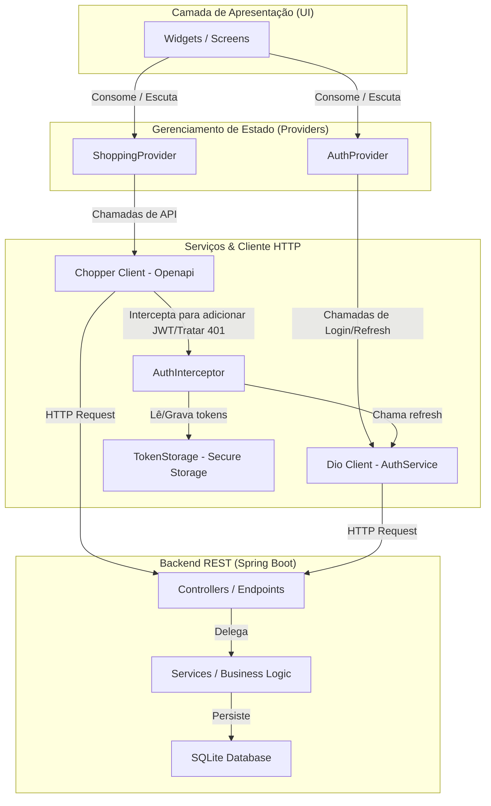
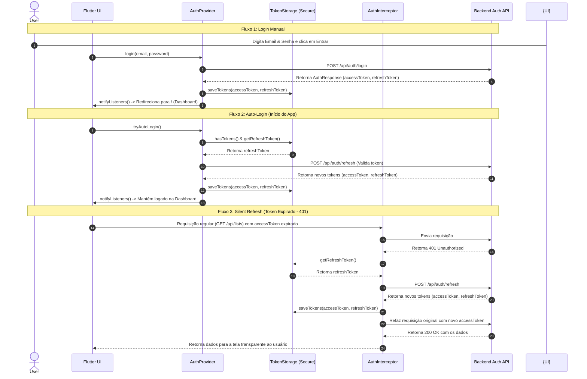

# 🏗️ Arquitetura do Sistema - Lista de Compras Backend

Este documento detalha o design de software, os padrões de arquitetura, o fluxo de dados e as decisões de projeto adotadas no ecossistema da aplicação **Lista de Compras**.

---

## 1. Diagrama de Camadas

A arquitetura do sistema segue o princípio de **Separação de Preocupações (Separation of Concerns)**, organizando o fluxo de dados de forma unidirecional e protegendo a integridade da UI contra detalhes de rede ou banco de dados.

### Detalhamento das Camadas:
1.  **Camada de Apresentação (UI):** Telas do Flutter e Widgets customizados. Não realizam chamadas diretas de rede ou controle de lógica complexa; elas apenas refletem o estado exposto pelos Providers e disparam eventos.
2.  **Gerenciamento de Estado (Providers):** Centraliza as regras da UI e caches locais em memória. Notifica a UI (`notifyListeners()`) quando ocorrem alterações (ex: adicionar item, mudar orçamento, alterar estado de login).
3.  **Serviços e Cliente HTTP (API/Chopper/Dio):** Abstração de rede.
    *   **Chopper:** Gerencia chamadas tipadas aos endpoints CRUD.
    *   **Dio:** Utilizado no serviço de autenticação (`AuthService`).
    *   **AuthInterceptor:** Garante injeção transparente de cabeçalhos de segurança e atualização silenciosa da sessão.
    *   **TokenStorage:** Armazena os segredos localmente no dispositivo.
4.  **Backend REST (Spring Boot):** Expõe recursos de listas de compras, itens e categorias, além de processamento inteligente de receitas.

---

## 2. Fluxo de Autenticação JWT

A segurança da aplicação é garantida por meio de um fluxo stateless baseado em tokens JWT curtos de acesso (*Access Token*) e tokens longos de renovação (*Refresh Token*).

---

## 3. Explicação dos Padrões Adotados

### 🟢 Provider (Gerenciamento de Estado)
O **Provider** atua como uma solução reativa e desacoplada baseada no padrão *InheritedWidget*. A lógica de negócios é mantida em classes que estendem `ChangeNotifier`. Quando uma alteração ocorre (como atualizar a quantidade de um item de compras), chamamos `notifyListeners()` para notificar os widgets assinantes e reconstruir apenas as seções necessárias da tela.

### 🔵 Chopper / OpenAPI (Abstração de API)
O **Chopper** simplifica o consumo de APIs REST no Flutter. Em vez de escrever requisições manuais em formato de strings brutas e lidar com serialização de JSON complexa, geramos a especificação da API no backend Spring Boot (OpenAPI/Swagger) e usamos o pacote `swagger_dart_code_generator` para ler essa especificação e gerar automaticamente todos os clientes HTTP tipados do Chopper.

### 🟡 go_router (Roteamento Declarativo)
O **go_router** gerencia a navegação com suporte a caminhos URL estruturados (essencial para Web e Deep Linking) e rotas aninhadas. Ele conta com uma propriedade `redirect`, que escuta alterações no `AuthProvider`. Caso o usuário não esteja logado, ele é automaticamente redirecionado para a tela de `/login`; caso tente acessar a tela de login já estando autenticado, é redirecionado para a tela inicial `/`.

---

## 4. Regras de Negócio do Sistema

Para garantir a coerência e integridade dos dados e evitar entradas maliciosas ou fora do escopo prático de compras, o backend aplica rigidamente 3 regras de negócio cruciais na validação dos itens:

1.  **Regra de Descrição do Item:**
    *   **Especificação:** O nome/descrição do item não pode ser nulo ou vazio e deve conter **entre 2 e 100 caracteres**.
    *   **Comportamento:** Impede descrições inexpressivas (como "a") ou excessivamente longas que quebrem o layout das interfaces.
2.  **Regra de Preço do Item:**
    *   **Especificação:** O preço unitário do item deve ser maior ou igual a **0.00** e no máximo **99.999,99**.
    *   **Comportamento:** Bloqueia preços negativos ou valores irracionais fora do escopo de bens de consumo normais.
3.  **Regra de Quantidade do Item:**
    *   **Especificação:** A quantidade do item deve ser no mínimo **0.01** e no máximo **9.999,00**.
    *   **Comportamento:** Permite pesagens decimais fracionadas (ex: 0.5 kg de carne) mas barra quantidades nulas, negativas ou inadequadas.

---

## 5. Decisões Arquiteturais Justificadas

*   **Uso de `flutter_secure_storage`:** Preferido em detrimento do `SharedPreferences` para armazenar chaves de segurança (tokens JWT). Enquanto o SharedPreferences salva em arquivos XML/JSON comuns sem criptografia, o Secure Storage utiliza *Keystore* (Android) e *Keychain* (iOS) garantindo proteção criptográfica a nível de hardware.
*   **Arquitetura Baseada em Interceptores:** Centralizar a lógica de renovação silenciosa de tokens no `AuthInterceptor` evita a necessidade de tratar expirações em cada chamada REST individualmente na camada de UI.
*   **SQLite como Banco de Dados do Backend:** SQLite foi selecionado para persistência do Spring Boot por ser um motor embarcado que não exige gerenciamento ou instalação de servidores externos (como MySQL ou PostgreSQL), facilitando a portabilidade e permitindo rodar a aplicação imediatamente.
